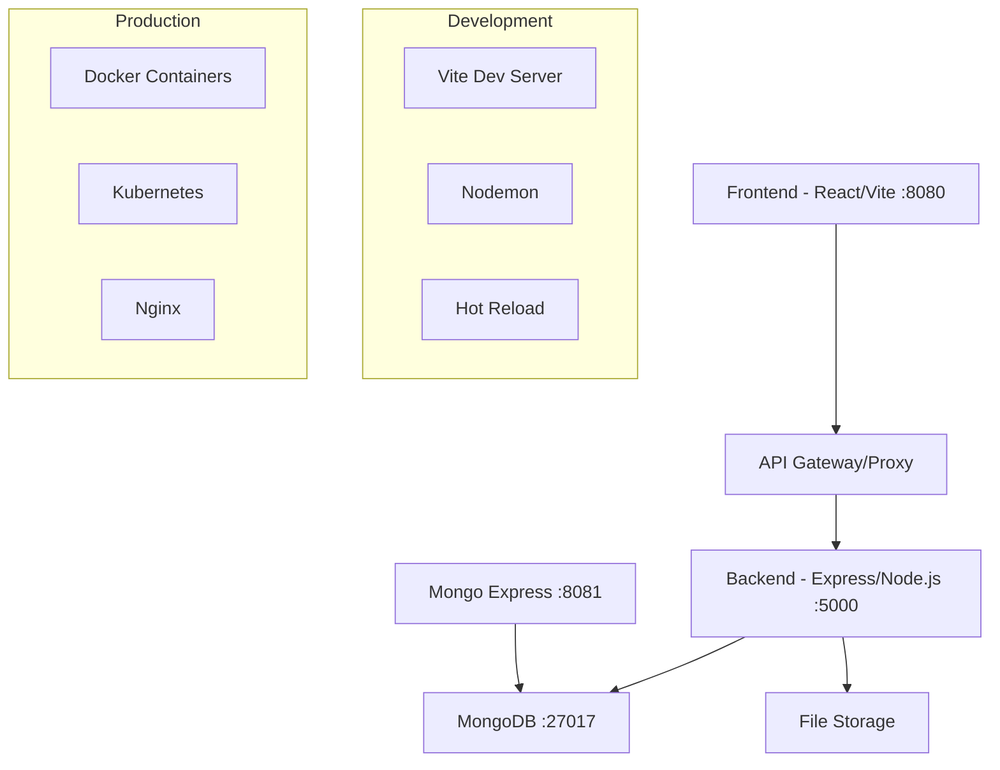

# 🏗️ Dine-Serve-Hub Tech Stack

**A comprehensive restaurant management system built with modern web technologies**

---

## 📋 Table of Contents

- [Project Overview](#-project-overview)
- [Architecture](#-architecture)
- [Frontend Stack](#-frontend-stack)
- [Backend Stack](#-backend-stack)
- [Database](#-database--storage)
- [Development Tools](#-development-tools)
- [Deployment](#-deployment--infrastructure)
- [Business Features](#-business-features)
- [Getting Started](#-getting-started)
- [Project Structure](#-project-structure)

---

## 🎯 Project Overview

**Dine-Serve-Hub** is a full-stack restaurant management SaaS platform designed for multi-tenant operations. It provides comprehensive solutions for restaurant operations including table management, order processing, menu management, and customer service across dine-in, takeaway, and delivery channels.

### Key Characteristics
- **Type**: Full-stack Monorepo
- **Architecture**: Frontend + Backend + Database
- **Pattern**: Multi-tenant SaaS
- **Deployment**: Docker & Kubernetes ready

---

## 🏛️ Architecture



**Data Flow:**
```
User Interface → API Proxy → Express Routes → Controllers → Models → MongoDB
                                        ↓
                           File Uploads → Multer → Local/Cloud Storage
```

---

## 🖥️ Frontend Stack

### **Core Framework**
| Technology | Version | Purpose |
|------------|---------|---------|
| **React** | 18.3.1 | UI Library & Component Framework |
| **TypeScript** | 5.8.3 | Type-safe JavaScript |
| **Vite** | 5.4.19 | Build Tool & Dev Server |
| **React Router** | 6.30.1 | Client-side Routing |

### **UI & Design System**
| Technology | Version | Purpose |
|------------|---------|---------|
| **Tailwind CSS** | 3.4.17 | Utility-first CSS Framework |
| **Radix UI** | Latest | Headless Component Primitives |
| **Material-UI** | 5.15.20 | Component Library |
| **Lucide React** | 0.462.0 | Icon Library |
| **shadcn/ui** | Custom | Design System Components |

### **State Management & Data**
| Technology | Version | Purpose |
|------------|---------|---------|
| **TanStack Query** | 5.83.0 | Server State Management |
| **React Hook Form** | 7.61.1 | Form State & Validation |
| **Zod** | 3.25.76 | Schema Validation |
| **Axios** | 1.7.2 | HTTP Client |

### **Additional Libraries**
- **React Leaflet** - Interactive Maps
- **Recharts** - Data Visualization
- **date-fns** - Date Manipulation
- **Embla Carousel** - Carousel Components
- **Sonner** - Toast Notifications

---

## ⚙️ Backend Stack

### **Core Framework**
| Technology | Version | Purpose |
|------------|---------|---------|
| **Node.js** | Latest LTS | JavaScript Runtime |
| **Express.js** | 4.19.2 | Web Application Framework |
| **TypeScript** | 5.5.3 | Type Safety |

### **Database & ODM**
| Technology | Version | Purpose |
|------------|---------|---------|
| **MongoDB** | 8.5.1 | NoSQL Document Database |
| **Mongoose** | 8.5.1 | MongoDB Object Data Modeling |

### **Authentication & Security**
| Technology | Version | Purpose |
|------------|---------|---------|
| **jsonwebtoken** | 9.0.2 | JWT Authentication |
| **bcryptjs** | 2.4.3 | Password Hashing |
| **Helmet** | 7.1.0 | Security Headers |
| **CORS** | 2.8.5 | Cross-Origin Resource Sharing |
| **Express Rate Limit** | 7.3.1 | API Rate Limiting |

### **API & Documentation**
| Technology | Version | Purpose |
|------------|---------|---------|
| **Swagger JSDoc** | 6.2.8 | API Documentation Generation |
| **Swagger UI Express** | 5.0.0 | Interactive API Explorer |
| **Express Validator** | 7.1.0 | Input Validation & Sanitization |

### **Middleware & Utilities**
- **Morgan** - HTTP Request Logging
- **Compression** - Response Compression
- **Winston** - Application Logging
- **Multer** - File Upload Handling
- **Dotenv** - Environment Configuration

---

## 🗄️ Database & Storage

### **Primary Database**
- **MongoDB 7** - Document-based NoSQL database
- **Mongo Express** - Web-based admin interface

### **Database Schema Overview**
```javascript
// Core Collections
Users           // Authentication & user management
Tenants         // Multi-tenant organization data
Tables          // Restaurant table management
Orders          // Order processing & tracking
MenuItems       // Menu & inventory management
Payments        // Payment processing records
Reservations    // Table booking system
```

### **Key Features**
- Multi-tenant data isolation
- ACID transactions support
- Indexing for performance optimization
- Aggregation pipelines for analytics

---

## 🛠️ Development Tools

### **Build & Development**
| Tool | Purpose |
|------|---------|
| **Vite** | Fast build tool with HMR |
| **Nodemon** | Auto-restart development server |
| **ts-node** | Direct TypeScript execution |
| **Concurrently** | Run multiple dev commands |

### **Code Quality**
| Tool | Purpose |
|------|---------|
| **ESLint** | JavaScript/TypeScript linting |
| **TypeScript** | Static type checking |
| **Lovable Tagger** | Component development tagging |

### **Testing**
- **Jest** - Unit & Integration Testing (Backend)

---

## 🚀 Deployment & Infrastructure

### **Containerization**
```dockerfile
# Multi-stage Docker builds
FROM node:18-alpine AS builder
# Build process...

FROM nginx:alpine AS production
# Serve static files...
```

### **Services**
| Service | Port | Purpose |
|---------|------|---------|
| **Frontend** | 8080 | Vite dev server |
| **Backend** | 5000 | Express API server |
| **MongoDB** | 27017 | Database |
| **Mongo Express** | 8081 | DB admin interface |
| **Production** | 80 | Nginx reverse proxy |

### **Orchestration**
- **Docker Compose** - Local development
- **Kubernetes** - Production deployment
- **Nginx** - Reverse proxy & static file serving

---

## 🎯 Business Features

### **Core Modules**

#### 🍽️ **Restaurant Management**
- Multi-location support
- Table layout configuration
- Staff role management
- Real-time occupancy tracking

#### 📋 **Order Management**
- **Dine-in**: Table-based ordering
- **Takeaway**: Quick order processing  
- **Delivery**: Route optimization
- Order status tracking
- Kitchen display integration

#### 🧾 **Menu Management**
- Category-based organization
- Pricing & availability control
- Nutritional information
- Multi-language support

#### 💳 **Payment Processing**
- Multiple payment methods
- Split billing
- Tip management
- Receipt generation

#### 📊 **Analytics & Reporting**
- Sales analytics
- Performance metrics
- Customer insights
- Inventory reports

### **User Roles**
- **Super Admin**: System-wide management
- **Tenant Admin**: Restaurant-specific admin
- **Manager**: Operational management
- **Staff**: Daily operations
- **Customer**: Order placement

---

## 🚀 Getting Started

### **Prerequisites**
```bash
Node.js >= 18.0.0
MongoDB >= 5.0
Docker (optional)
```

### **Installation**

1. **Clone the repository**
   ```bash
   git clone <repository-url>
   cd dine-serve-hub
   ```

2. **Install dependencies**
   ```bash
   # Root dependencies
   npm install
   
   # Backend dependencies
   cd backend && npm install
   ```

3. **Environment setup**
   ```bash
   # Copy environment files
   cp .env.example .env
   cp backend/.env.example backend/.env
   ```

4. **Database setup**
   ```bash
   # Start MongoDB (Docker)
   docker-compose up mongodb
   
   # Or start local MongoDB
   mongod --dbpath /path/to/data
   ```

5. **Start development servers**
   ```bash
   # Start both frontend and backend
   npm run dev
   
   # Or separately
   npm run dev:frontend
   npm run dev:backend
   ```

### **Development URLs**
- **Frontend**: http://localhost:8080
- **Backend API**: http://localhost:5000
- **API Docs**: http://localhost:5000/api-docs
- **Mongo Express**: http://localhost:8081

---

## 📁 Project Structure

```
dine-serve-hub/
├── src/                          # Frontend source
│   ├── components/               # React components
│   │   ├── ui/                  # Base UI components
│   │   ├── tables/              # Table management
│   │   ├── orders/              # Order components
│   │   └── layouts/             # Layout components
│   ├── pages/                   # Route components
│   ├── hooks/                   # Custom React hooks
│   ├── contexts/                # React contexts
│   ├── types/                   # TypeScript definitions
│   └── config/                  # Configuration files
│
├── backend/                     # Backend source
│   ├── src/
│   │   ├── controllers/         # Route controllers
│   │   ├── models/              # Database models
│   │   ├── routes/              # API routes
│   │   ├── middleware/          # Express middleware
│   │   ├── config/              # Database & app config
│   │   ├── utils/               # Utility functions
│   │   └── swagger/             # API documentation
│   └── dist/                    # Compiled JavaScript
│
├── public/                      # Static assets
├── k8s/                        # Kubernetes configs
├── nginx/                      # Nginx configuration
├── docker-compose.yml          # Docker services
├── Dockerfile                  # Production image
└── package.json               # Project dependencies
```

---

## 📈 Performance & Scalability

### **Frontend Optimizations**
- Code splitting with React.lazy()
- Bundle optimization with Vite
- Image optimization
- Lazy loading components

### **Backend Optimizations**
- Database indexing
- Query optimization
- Response compression
- Rate limiting
- Caching strategies

### **Infrastructure**
- Horizontal scaling with K8s
- Load balancing
- Database replication
- CDN integration

---

## 🤝 Contributing

### **Development Workflow**
1. Feature branch creation
2. Development with TypeScript
3. Testing (unit & integration)
4. Code review process
5. Deployment to staging
6. Production deployment

### **Code Standards**
- TypeScript strict mode
- ESLint configuration
- Component-driven development
- RESTful API design
- Comprehensive error handling

---

## 📄 License

This project is proprietary software. All rights reserved.

---

## 📞 Support

For technical support or questions:
- **Documentation**: `/api-docs` endpoint
- **Issues**: Project issue tracker
- **Email**: support@zeduno.com

---

*Last updated: August 2025*
